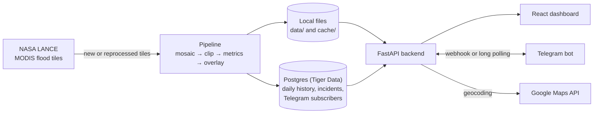

# DisTrack: satellite flood tracking for Vietnam

DisTrack turns NASA's near-real-time satellite flood maps into a dashboard that responders can act on. It shows where flooding is, how it is trending, and what is happening at a specific address, and it can push alerts to Telegram.

Built at StormHacks 2026. Live at **[distrack.tech](https://distrack.tech)**.

> DisTrack shows satellite observations, not ground truth. Clouds, terrain shadow and timing can hide or misclassify flooding. For emergency decisions, follow official local alerts.

## Features

- **Daily flood map of Vietnam.** As soon as NASA publishes a complete day of its MODIS flood product, DisTrack downloads the tiles that cover Vietnam, clips them to the national border and draws the flooded areas on the map.
- **Flood metrics.** Shows the flooded area in km² for the day, calculated from each pixel's real area on the ground, along with the number of flagged pixels.
- **History and trend.** Every processed day is saved. You can open any saved day to see its map and numbers, and follow how the flooded area changes over time.
- **Inspect any location.** Click the map, pick a city or search for an address. DisTrack shows the satellite finding at that point, the province, and how much flooding there is within a few kilometres.
- **Response board and hotspots.** Saved locations are labelled by severity (High, Moderate or Watch) and tracked through *open → verified → dispatched → resolved*, with notes. The provinces with the most incidents are listed as hotspots.
- **Telegram alerts.** Anyone can subscribe by sending `/start` to the DisTrack bot. A responder can send an inspected location to every subscriber in one click.

## How it works



The pipeline (`backend/disaster-tracker-backend/app/core/pipeline.py`) works in five steps:

1. It works out which 10° tiles of the flood product the Vietnam border touches: `h28v06`, `h28v07`, `h28v08`, `h29v07` and `h29v08`.
2. It finds the newest UTC day on which NASA has published all of those tiles. A day fills in over several hours, so the newest day is skipped until it is complete.
3. It downloads only new tiles, or tiles NASA has reprocessed since the last run.
4. It stitches the tiles together and clips them to the border. It then marks pixels classed as *unusual flood*, adds up their area, and draws a transparent overlay image.
5. It saves the day to Postgres: the overlay, the stitched GeoTIFF and the metrics. There is one row per day.

The API runs the pipeline when it starts, then every 60 minutes. A new server (a fresh deploy, for example) first restores the newest saved day from the database, so the dashboard has data within seconds.

## Tech stack

| Part | Built with |
| --- | --- |
| Backend | Python 3.14, FastAPI, rasterio, GeoPandas, Shapely, pyproj, Pillow, SQLAlchemy and psycopg, managed with uv |
| Frontend | React 19, TypeScript, Vite. The map is plain SVG, with no map library. |
| Data | [NASA LANCE](https://www.earthdata.nasa.gov/data/tools/lance) MODIS Near Real-Time Global Flood Product (`MCDWD_L3_F2_NRT`) and Vietnam administrative boundaries |
| Storage | Postgres on Tiger Data (optional) |
| Hosting | Render, at distrack.tech |

## Repository layout

```text
backend/disaster-tracker-backend/
  app/
    core/       pipeline, LANCE downloader, mosaic, clipping, rendering, history, Telegram, alerts
    routes/     API endpoints (flood, history, health)
    main.py     FastAPI app and startup (database schema, data restore, poller, Telegram)
  db/           schema.sql and SQLAlchemy models
  vnm_admin_boundaries.shp.zip    Vietnam boundaries, extracted automatically on first run
frontend/disaster-tracker/
  src/          components, hooks and helpers for the dashboard
```

## Getting started

You need:

- Python 3.14 or newer, and [uv](https://docs.astral.sh/uv/).
- Node.js 22 or newer, and npm.
- A [NASA Earthdata](https://urs.earthdata.nasa.gov/) token.

### Backend

```bash
git clone https://github.com/Tmhduc/stormhack26-natural-disasters.git
cd stormhack26-natural-disasters/backend/disaster-tracker-backend
uv sync
```

Create a `.env` file in `backend/disaster-tracker-backend`. Only `NASA_TOKEN` is needed to start. The other settings turn on optional features (see [Configuration](#configuration)).

```ini
NASA_TOKEN=your-earthdata-token
```

Start the API:

```bash
uv run uvicorn app.main:app --reload --reload-include .env
```

The API runs at http://localhost:8000, with interactive docs at http://localhost:8000/docs.

On first start, the backend extracts the boundary files and runs the pipeline. That downloads about 5 MB of tiles and takes well under a minute on a laptop. `--reload-include .env` makes the server restart when you edit `.env` as well as when you edit code.

### Frontend

In a second terminal:

```bash
cd frontend/disaster-tracker
npm install
npm run dev
```

Open http://localhost:5173. The development server forwards `/api` and `/static` requests to the backend at `http://127.0.0.1:8000`. To use a different backend, set `VITE_BACKEND_TARGET`.

## Configuration

Put backend settings in `backend/disaster-tracker-backend/.env`. Git ignores this file, so never commit it.

| Variable | Default | What it does |
| --- | --- | --- |
| `NASA_TOKEN` | none | NASA Earthdata token, sent with tile downloads. |
| `DATABASE_URL` | none | Postgres connection URL. Needed for history, the trend chart, the response board and Telegram subscriptions. Without it, the app runs from local files only. |
| `GOOGLE_MAPS_API_KEY` | none | Turns on address search and street addresses for inspected points, using the Google Geocoding API. |
| `TELEGRAM_BOT_TOKEN` | none | Turns on Telegram alerts. |
| `TELEGRAM_CHAT_ID` | none | One chat that receives every alert, in addition to subscribers. |
| `TELEGRAM_WEBHOOK_BASE_URL` | `RENDER_EXTERNAL_URL` | The backend's public URL. When it is known, Telegram sends messages to a webhook instead of being polled. |
| `TWILIO_ACCOUNT_SID`, `TWILIO_AUTH_TOKEN`, `TWILIO_FROM_NUMBER` | none | Turn on SMS alerts through `POST /api/flood/alerts/sms`. |
| `LANCE_POLL_MINUTES` | `60` | How often to check NASA for new data. `0` turns checking off. |
| `LANCE_PRODUCT` | `MCDWD_L3_F2_NRT` | Which composite to use: `F1` (1-day), `F1C` (1-day, cloud-shadow masked), `F2` (2-day) or `F3` (3-day). |
| `LANCE_TILES` | every tile the border touches | Comma-separated tile IDs, for example `h28v07`. |
| `LANCE_LOOKBACK_DAYS` | `7` | How many days back to search for a complete day. |
| `LANCE_DATA_LAG_DAYS` | `1` | How many of the newest days to skip, because they may still be incomplete. |
| `BROWSER_BOUNDARY_TOLERANCE` | `0.005` | How much the border outline sent to the browser is simplified, in degrees. |

The connection URL Tiger Data shows leaves out the database password. Either add the password to `DATABASE_URL`, or download `pg_service.conf` from the Tiger console into `backend/disaster-tracker-backend`. The backend reads the password from that file, and Git ignores it too.

Frontend settings:

| Variable | Used for |
| --- | --- |
| `VITE_API_URL` | Production builds: the backend's URL. Leave it empty if the frontend and the API are served from the same site. |
| `VITE_BACKEND_TARGET` | Development: the backend that `npm run dev` forwards requests to. |

## Running the pipeline by hand

Run these from `backend/disaster-tracker-backend`:

```bash
uv run python -m app.core.pipeline                    # newest complete day
uv run python -m app.core.pipeline --date 2026-10-01  # a specific UTC day
uv run python -m app.core.pipeline --force            # rebuild even if nothing changed
```

NASA keeps only about 8 days online. To save days the pipeline missed, run it with `--date` for each of them, then once more without `--date` to go back to the newest day. You can also trigger a run from the dashboard (**Refresh satellite data**) or with `POST /api/flood/refresh`.

## Telegram alerts

1. Create a bot with [@BotFather](https://t.me/BotFather).
2. Set `TELEGRAM_BOT_TOKEN` in `.env`.
3. Restart the backend.

Nobody has to edit `.env` to add a recipient:

- **Subscribe:** people click **Get Telegram alerts** on the dashboard, or open the bot and tap **Start**.
- **Unsubscribe:** send `/stop` to the bot.
- **Groups:** to alert a whole group, add the bot to the group and send `/start` there.

Subscriptions are stored in the database. A chat that blocks the bot is removed automatically the next time an alert is sent.

How the backend receives the bot's messages depends on where it runs:

- **Deployed:** a backend with a public URL registers a webhook, and Telegram sends it each message.
- **Locally:** the backend asks Telegram for new messages instead (long polling). Telegram allows only one bot listener at a time, so while a deployment owns the bot, a local backend stops listening. It can still send alerts.
- **Switching back to local:** open `https://api.telegram.org/bot<TOKEN>/deleteWebhook` once.

## API

Interactive documentation is available at `/docs` on any running backend.

| Method | Path | Purpose |
| --- | --- | --- |
| GET | `/api/health` | Status of the API, database, pipeline and integrations |
| GET | `/api/flood/metrics` | Flooded area, pixel count, date and tiles for the current day |
| GET | `/api/flood/overlay` | URL and bounds of the flood overlay image |
| GET | `/api/flood/boundary` | Simplified outline of Vietnam (GeoJSON) |
| GET | `/api/flood/inspect?lat=&lon=&radius_km=` | Satellite class, province, address and nearby flooding at a point |
| GET | `/api/flood/geocode?q=` | Address search |
| GET | `/api/flood/status` | What the pipeline last loaded, when it last checked, and its last error |
| POST | `/api/flood/refresh?day=&force=` | Run the pipeline now |
| GET | `/api/flood/history?limit=` | Saved days, newest first |
| GET | `/api/flood/history/{id}/overlay.png` | Overlay image for one saved day |
| GET | `/api/flood/history/trend?limit=` | Daily totals for the trend chart |
| GET, POST | `/api/flood/history/incidents` | List or save locations on the response board |
| PATCH, DELETE | `/api/flood/history/incidents/{id}` | Update the status or notes of a location, or remove it |
| GET | `/api/flood/history/hotspots?days=` | Saved incidents grouped by province |
| GET | `/api/flood/alerts/telegram` | Telegram subscribe link and number of recipients |
| POST | `/api/flood/alerts/telegram` | Send a message to every Telegram subscriber |
| POST | `/api/flood/alerts/sms` | Send an SMS through Twilio |

## Deploying

DisTrack runs on [Render](https://render.com): the backend as a web service and the frontend as a static site.

**Backend.**

- **Start command:** `uv run uvicorn app.main:app --host 0.0.0.0 --port $PORT`.
- **Settings:** add the variables from [Configuration](#configuration).
- **Fresh disks:** a Render instance starts with an empty disk on every deploy, and each time a free instance wakes from sleep. The backend handles this on startup. It extracts the boundary files, then restores the newest day saved in the database.
- **Telegram:** the webhook is registered automatically, using the `RENDER_EXTERNAL_URL` that Render provides.

**Memory.** Measured peaks:

| Workload | Peak memory |
| --- | --- |
| Serving the dashboard (data, outline, inspect) | about 450 MB |
| Running the pipeline inside the server (refresh or polling) | about 500 MB |

On a 512 MB instance there is almost no headroom when the pipeline runs. Either:

- use an instance with 1 GB or more, or
- set `LANCE_POLL_MINUTES=0`, run the pipeline elsewhere against the same database, and then restart the service to pick up the new day.

If every request returns a Render 502 page with the header `x-render-routing: no-deploy`, no instance is running. Check the service's Events and Logs for an out-of-memory restart.

**Frontend.** Build it with `npm run build` and publish the `dist` folder. Set `VITE_API_URL` to the backend's URL. The backend accepts browser requests only from the origins listed in `app/main.py`, so add any new frontend domain there.

## Development

- **Backend tests:** run `uv run python test_backend.py` from `backend/disaster-tracker-backend`.
- **Frontend checks:** run `npm run lint` and `npm run build` from `frontend/disaster-tracker`.
- **Secrets and generated files:** `.env`, `pg_service.conf`, `data/` and `cache/` hold secrets or generated files. Git ignores them, so never commit them.

## Data sources

- **Flood data:** NASA LANCE MODIS Near Real-Time Global Flood Product, `MCDWD_L3_F2_NRT` ([doi:10.5067/MODIS/MCDWD_L3_NRT.061](https://doi.org/10.5067/MODIS/MCDWD_L3_NRT.061)). We acknowledge the use of data from NASA's Land, Atmosphere Near real-time Capability (LANCE), part of the Earth Science Data Systems program.
- **Boundaries:** Vietnam country and province boundaries, included in the repository as `backend/disaster-tracker-backend/vnm_admin_boundaries.shp.zip`.
